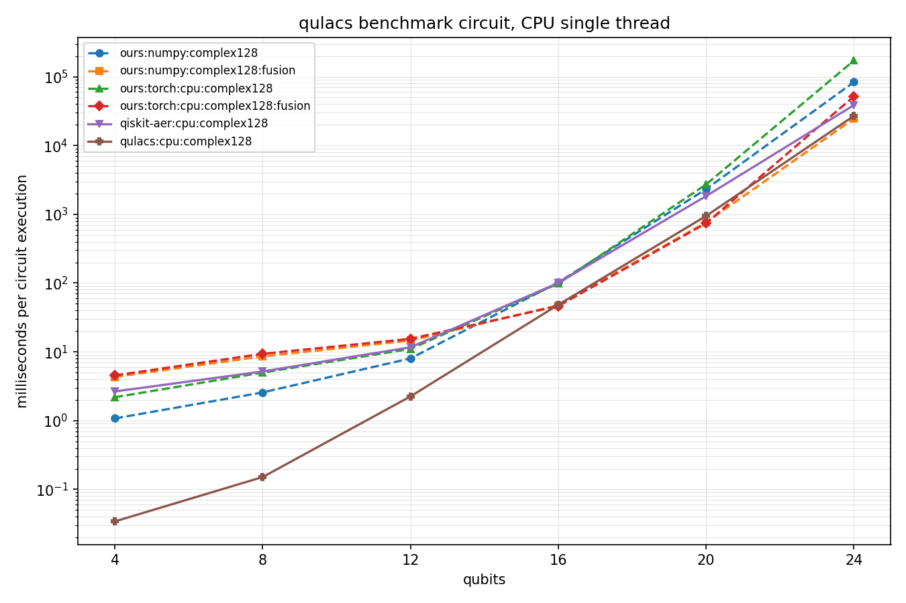
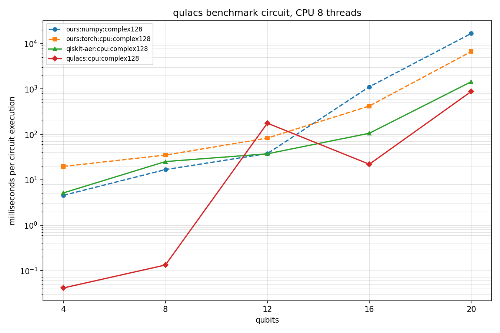
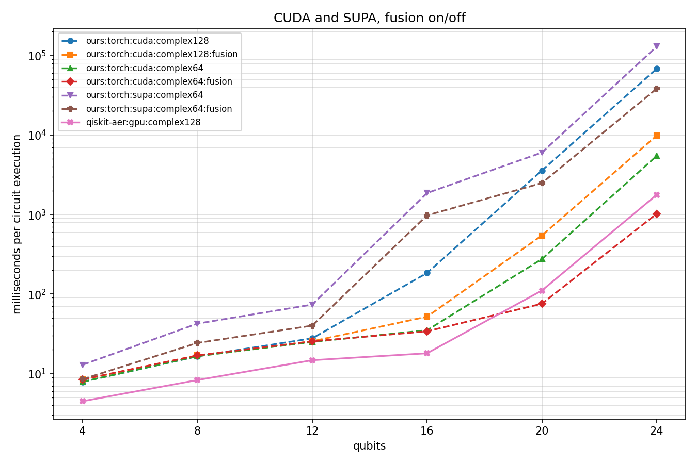

# Simple StateVector Simulator

一个用 Python 和 NumPy 实现的轻量级量子计算模拟器。使用完整 statevector 表示纯态，通过局部酉矩阵执行量子门，并支持可插拔的计算后端（NumPy / PyTorch，CPU， CUDA和SUPA）。

## 设计动机

statevector 模拟的核心计算，本质上就是稠密矩阵乘法。$n$ qubit 的态是长度 $2^n$ 的复向量，对其中 $k$ 个 qubit 施加量子门，等价于把振幅重排成 $2^k \times 2^{n-k}$ 的矩阵后左乘一个 $2^k \times 2^k$ 的酉矩阵——在 [src/torch_backend.py](src/torch_backend.py) 里就是 `matrix @ batched_amplitudes` 这一行，其余都是轴置换。

这正是机器学习领域被打磨得最充分的一类运算。多年来大量研究者和工程师围绕 GPU 上的矩阵乘法做了深度优化：kernel 融合、访存布局、混合精度、批处理调度。这些成果与量子门的数学形式高度吻合，因此不必自己写 CUDA kernel，直接把 PyTorch 当作后端就能继承整条已经成熟的加速链路。

实测结果支持这个判断，并且门融合在大规模电路上能进一步减少后端调用和张量重排成本（[详细数据](#性能基准)）。

**自动微分是选择 PyTorch 的另一个理由，但目前尚未启用。** 变分量子算法需要对门参数求梯度，而这恰是自动微分框架的强项。当前门函数只接受 Python 实数（传入张量会抛 `TypeError`）。要支持可微模拟，需要让门参数接受张量——这是后端抽象为将来预留的方向，而不是现有能力。

## 性能基准

基准采用深度 9 的 qulacs benchmark 电路，每个 qubit 对应 41 个门；每项先预热一次，再重复 5 次并取最小值。表中为完整电路执行时间，单位为毫秒。Fusion 的计时包含每次 `StateVectorSimulator.run()` 内的融合编译成本，因此是开关的端到端结果。误差为相对 Qiskit Aer 参考态、消去全局相位后的最大振幅偏差。

完整数据和图表： [CPU single](benchmarks/results/cpu-single.json)、[CPU multi](benchmarks/results/cpu-multi.json)、[CUDA & SUPA](benchmarks/results/cuda-supa.json)。详细方法见 [benchmarks/README.md](benchmarks/README.md)。

### CPU single

| implementation | 4 | 8 | 12 | 16 | 20 | 24 | 最大误差 |
|---|---:|---:|---:|---:|---:|---:|---:|
| qiskit-aer:cpu:complex128 | 2.654 | 5.183 | 11.656 | 100.551 | 1841.274 | 38679.676 | 0.000e+00 |
| ours:numpy:complex128 | 1.077 | 2.571 | 8.031 | 102.248 | 2322.285 | 83694.680 | 3.619e-16 |
| ours:numpy:complex128:fusion | 4.323 | 8.604 | 14.601 | 47.631 | 762.749 | 24594.635 | 3.775e-16 |
| ours:torch:cpu:complex128 | 2.189 | 4.994 | 11.037 | 98.182 | 2723.063 | 171739.202 | 4.173e-16 |
| ours:torch:cpu:complex128:fusion | 4.549 | 9.364 | 15.464 | 46.352 | 740.480 | 51796.064 | 3.775e-16 |
| qulacs:cpu:complex128 | 0.034 | 0.151 | 2.250 | 48.432 | 946.080 | 26973.122 | 3.619e-16 |



### CPU multi

| implementation | 4 | 8 | 12 | 16 | 20 | 24 | 最大误差 |
|---|---:|---:|---:|---:|---:|---:|---:|
| qiskit-aer:cpu:complex128 | 2.643 | 5.165 | 11.614 | 165.317 | 407.997 | 6799.508 | 0.000e+00 |
| ours:numpy:complex128 | 1.153 | 2.736 | 8.304 | 710.007 | 6695.238 | 90602.686 | 3.619e-16 |
| ours:numpy:complex128:fusion | 4.414 | 8.878 | 15.085 | 309.113 | 2806.949 | 38060.738 | 3.775e-16 |
| ours:torch:cpu:complex128 | 2.162 | 4.818 | 11.074 | 506.165 | 783.045 | 57331.052 | 4.173e-16 |
| ours:torch:cpu:complex128:fusion | 4.696 | 9.614 | 15.718 | 119.613 | 250.563 | 24400.303 | 3.775e-16 |
| qulacs:cpu:complex128 | 0.034 | 0.152 | 200.729 | 119.065 | 313.060 | 6302.665 | 3.619e-16 |



### CUDA & SUPA

CUDA 在 Tesla T4 16 GiB 上运行；SUPA 在 Biren106M 32 GiB 上运行。两组来自不同主机，表格用于展示已测环境中的实际端到端表现，不是同机硬件微基准。SUPA 只保留本项目后端，不混入其运行主机上的 CPU 或其他框架结果。

| implementation | 4 | 8 | 12 | 16 | 20 | 24 | 最大误差 |
|---|---:|---:|---:|---:|---:|---:|---:|
| qiskit-aer:gpu:complex128 | 4.499 | 8.302 | 14.750 | 18.021 | 110.803 | 1770.893 | 0.000e+00 |
| ours:torch:cuda:complex64 | 7.893 | 16.553 | 25.014 | 35.131 | 275.556 | 5456.028 | 1.933e-07 |
| ours:torch:cuda:complex64:fusion | 8.443 | 16.946 | 25.464 | 34.073 | 75.613 | 1022.382 | 1.538e-07 |
| ours:torch:cuda:complex128 | 7.891 | 16.511 | 27.783 | 184.154 | 3576.542 | 68013.105 | 4.408e-16 |
| ours:torch:cuda:complex128:fusion | 8.395 | 16.930 | 25.525 | 51.999 | 545.602 | 9819.301 | 5.237e-16 |
| ours:torch:supa:complex64 | 12.917 | 42.538 | 73.780 | 1863.836 | 6018.695 | 129276.047 | 1.451e-05 |
| ours:torch:supa:complex64:fusion | 8.512 | 24.317 | 40.125 | 976.896 | 2486.712 | 38228.905 | 4.798e-06 |



### 结论

- **Fusion 在大规模电路上效果明显。** 24 qubits 时，CPU single 的 NumPy/Torch 分别加速 3.40 倍和 3.32 倍，CPU multi 分别加速 2.38 倍和 2.35 倍；CUDA `complex64`/`complex128` 分别加速 5.34 倍和 6.93 倍，SUPA `complex64` 加速 3.38 倍。小电路中融合编译成本可能抵消收益，因此 4–12 qubits 不一定更快。
- **该工作负载下 CUDA 明显快于 SUPA。** 对同为 `complex64 + fusion` 的实现，CUDA 在 16、20、24 qubits 分别快约 28.7、32.9、37.4 倍。已定位的主要原因是 SUPA 对非连续 `permute` 结果执行二维 `reshape` 时会物化新 storage，逐门复制完整 statevector；CUDA/PyTorch 对相同布局的处理成本低得多。具体 stride 和复制实验见 [SUPA 张量布局限制](benchmarks/README.md#supa-张量布局限制)。
- **数值误差很小。** CPU 与 CUDA `complex128` 相对参考实现的最大振幅误差不超过 $5.24\times10^{-16}$；CUDA `complex64` 不超过 $1.94\times10^{-7}$。SUPA `complex64` 的最大值为 $1.46\times10^{-5}$，fusion 后降至 $4.80\times10^{-6}$，仍处于单精度计算的较小误差范围。
- **CUDA 上 `complex128` 的代价很高。** 20 和 24 qubits 时，未融合的 `complex128` 分别比 `complex64` 慢约 13.0 倍和 12.5 倍；开启 fusion 后仍慢约 7.2 倍和 9.6 倍。若任务不要求双精度，GPU 默认应使用 `complex64`。

## 特性

- 单比特、双比特、三比特量子门，支持任意 qubit 子集上的通用门应用
- `Circuit` 电路结构与电路级 dagger
- 可插拔后端：`NumpyBackend`、`TorchBackend`（CPU / CUDA，`complex64` / `complex128`）
- 不破坏量子态的多次采样
- `Observable`：加权 Pauli 串求和，用于计算期望值
- OpenQASM 2 导出与解析

暂不包含：投影测量与态坦缩（[有意排除](docs/architecture.md)）、电路中间测量、OpenQASM 3、密度矩阵与噪声。

## 快速上手

### 创建环境

日常开发用 CPU 环境即可。创建脚本是幂等的：环境不存在时创建，依赖文件未变化时直接跳过。

Windows：

```powershell
.\envs\cpu\create-env.ps1
.\.venv-cpu\Scripts\Activate.ps1
$env:PYTHONPATH = Join-Path $PWD 'src'
```

Linux：

```bash
bash envs/cpu/create-env.sh
source .venv-cpu/bin/activate
export PYTHONPATH="$PWD/src"
```

需要 GPU 时换用 `envs/cuda`（对应 `.venv-cuda`）。全部环境的清单、平台限制与激活方式见 [envs/README.md](envs/README.md)。

`PYTHONPATH` 这一行的原因是 `src/` 为扁平布局，而 Python 只把**脚本自身所在的目录**加入 `sys.path`：写在仓库根的脚本、`python -c` 以及 `unittest discover` 都需要它。`examples/` 与 `benchmarks/` 下的脚本已自行插入 `src`，直接运行即可。

### 运行第一个电路

```python
import numpy as np

from circuit import Circuit
from observable import Observable
from simulator import StateVectorSimulator
from single_qubit_gates import H
from two_qubit_gates import CX

circuit = Circuit(2).append(H(0)).append(CX(0, 1))
state = StateVectorSimulator().run(circuit)

state.amplitudes
# array([0.70710678+0.j, 0.+0.j, 0.+0.j, 0.70710678+0.j])

state.sample(1000, np.random.default_rng(7))
# {0: 502, 3: 498}

state.expectation(Observable([(1.0, {0: "Z", 1: "Z"})]))
# 0.9999999999999998
```

采样只依赖注入的 `numpy.random.Generator`，因此相同 seed 在所有后端上结果一致。

指定后端：

```python
from torch_backend import TorchBackend

simulator = StateVectorSimulator(TorchBackend(device="cuda", dtype="complex64"))
```

### 支持的后端

| 类名 | 所在文件 | 支持的 device | 支持的 dtype |
|---|---|---|---|
| `NumpyBackend` | [src/numpy_backend.py](src/numpy_backend.py) | CPU | `complex64`、`complex128` |
| `TorchBackend` | [src/torch_backend.py](src/torch_backend.py) | `cpu`、`cuda` | `complex64`、`complex128` |
| `TorchBackend` | [src/torch_backend.py](src/torch_backend.py) | `supa` | `complex64` |

`cuda` 和 `supa` 设备需要对应硬件及运行环境可用；环境定义与平台限制见 [envs/README.md](envs/README.md)。

## 用 Agent 编写程序

仓库自带一个 skill，放在 [.agents/skills/quantum-simulator/](.agents/skills/quantum-simulator/)。VS Code、opencode 等支持 Agent Skills 的工具打开本目录即可发现它，无需额外配置。`.agents/` 是厂商中立的约定位置，与仓库已有的 [AGENTS.md](AGENTS.md) 一致。

直接用自然语言描述需求即可，例如：

```text
构造一个 3 qubit 的 GHZ 态，采样 2000 次
用 QFT 变换 |5>，把振幅向量导出来
算一下 Bell 态上 Z0Z1 的期望值
```

也可以在聊天框输入 `/quantum-simulator` 显式调用。

skill 把工作拆成三步：

**1. 初始化环境。** agent 按任务挑选 [envs/](envs/) 下的环境并运行其创建脚本：

| 任务 | 环境 | 解释器 |
|---|---|---|
| 日常开发、跑测试 | `envs/cpu` | `.venv-cpu` |
| GPU 模拟 | `envs/cuda` | `.venv-cuda` |
| 跨框架基准 | `envs/bench-cpu` | `.venv-bench-cpu` |

脚本是幂等的，且与当前目录无关，venv 始终建在仓库根。完整清单与平台限制见 [envs/README.md](envs/README.md)。

**2. 编写代码。** agent 依据 [docs/api.md](docs/api.md) 和 [docs/gates.md](docs/gates.md) 生成程序，而不是靠记忆猜门名和参数顺序——这两份文档的内容是对照代码实测生成的。

**3. 运行并整理结果。** 用 venv 中的解释器执行，再按诉求分流输出：

| 诉求 | 输出 |
|---|---|
| 采样 | 全量写入 `results/sampling.csv`，前 10 条打印到对话 |
| 期望值 | 直接打印到对话，不落盘 |
| 振幅向量 | 写入 `results/amplitudes.json` |

CSV 的 key 已从整数转成二进制串，按次数从大到小排序，次数为 0 的结果不输出。`results/` 已加入 `.gitignore`。

格式化逻辑集中在 [qsim_report.py](.agents/skills/quantum-simulator/scripts/qsim_report.py)，手写程序也可以直接复用：

```powershell
$env:PYTHONPATH = "$PWD\src;$PWD\.agents\skills\quantum-simulator\scripts"
.\.venv\Scripts\python.exe your_program.py
```

```python
from qsim_report import write_sampling_csv, format_rows

path, top = write_sampling_csv(state.sample(2000), state.num_qubits)
print(format_rows(top))
```

打印到对话的表格形如：

```text
bitstring     count   probability
000             979      0.489500
011             945      0.472500
100              40      0.020000
```

两点提醒：`bitstring` 列在 Excel 中可能被当成数字而丢掉前导零，程序化读回时请用 `index` 列；振幅 JSON 是全量 $2^n$ 条记录，20 qubit 时约 100 MB，大寄存器应改用采样或期望值。

## 运行测试

```powershell
$env:PYTHONPATH = Join-Path $PWD 'src'
.\.venv\Scripts\python.exe -m unittest discover -s tests -v
```

当前 162 个测试全部通过（1 个在缺少 CUDA 时跳过）。其中后端一致性测试是参数化的，会在每个可用后端上重复验证 Bell 态、纠缠态局部门、非相邻 qubit、三比特门以及 dagger 还原。

## 示例

两个示例都自行把 `src` 加入 `sys.path`，无需设置 `PYTHONPATH`；都支持 `--backend` 参数：

```text
numpy:complex128  numpy:complex64
torch:cpu:complex128  torch:cpu:complex64
torch:cuda:complex128  torch:cuda:complex64
```

### 量子傅里叶变换

计算 QFT 末态振幅，并与解析解对比保真度：

$$
\text{QFT}|x\rangle=\frac{1}{\sqrt N}\sum_{k=0}^{N-1} e^{2\pi i xk/N}|k\rangle
$$

```powershell
.\.venv\Scripts\python.exe examples\qft_demo.py --qubits 3 --value 5 --show-amplitudes
```

```text
backend        : numpy:complex128
qubits         : 3
input state    : |5> = |101>
gate count     : 9
norm           : 1.000000000000
fidelity       : 1.000000000000
max abs error  : 9.328e-16

  index                         simulated                          expected
      0                0.353553+0.000000j                0.353553+0.000000j
      1               -0.250000-0.250000j               -0.250000-0.250000j
      2                0.000000+0.353553j                0.000000+0.353553j
      3                0.250000-0.250000j                0.250000-0.250000j
      4               -0.353553+0.000000j               -0.353553+0.000000j
      5                0.250000+0.250000j                0.250000+0.250000j
      6               -0.000000-0.353553j               -0.000000-0.353553j
      7               -0.250000+0.250000j               -0.250000+0.250000j
```

不同后端在 8 qubit、输入 $|173\rangle$ 下的精度对比：

| backend | fidelity | max abs error |
|---|---:|---:|
| `numpy:complex128` | 1.000000000000 | 1.1e-14 |
| `numpy:complex64` | 0.999999521755 | 2.7e-08 |
| `torch:cuda:complex64` | 0.999999554395 | 2.7e-08 |

### 哈密顿量模拟

横场 Ising 模型的一阶 Trotter 演化，与精确矩阵指数对比：

$$
H=-J\sum_j Z_jZ_{j+1}-h\sum_j X_j
$$

```powershell
.\.venv\Scripts\python.exe examples\hamiltonian_simulation_demo.py --qubits 5 --steps 1,3,9,27,81
```

```text
backend    : numpy:complex128
qubits     : 5
H          : -1.0 * sum ZZ - 0.7 * sum X
time       : 1.0

energy reference
  <H> from Observable       : -3.700000000000
  <H> from dense matrix     : -3.700000000000
  <H> after exact evolution : -3.700000000000  (conserved)

  steps    gates      infidelity    2-norm error  error ratio  step ratio     <H> error
      1       18       8.030e-01       1.148e+00                              4.020e+00
      3       52       8.013e-02       3.187e-01         3.60        3.00     3.897e-01
      9      154       9.111e-03       1.023e-01         3.12        3.00     7.169e-02
     27      460       1.027e-03       3.390e-02         3.02        3.00     1.786e-02
     81     1378       1.147e-04       1.129e-02         3.00        3.00     5.289e-03
```

这个示例包含三层验证：

**能量三方交叉验证。** `Observable`（Pauli 串求和）、稠密矩阵 $\langle\psi|H|\psi\rangle$（Kronecker 积构造）与解析值三者一致。初态 $|+\rangle_0|0000\rangle$ 可手算：

$$
\langle H\rangle=-J(0+1+1+1)-h(1+0+0+0)=-3.7
$$

任何一处端序写反都会让三者分道扬镳。

**误差标度律。** 一阶 Trotter 误差为 $O(t^2\|[A,B]\|/r)$，即 $\propto 1/\text{steps}$，因此 error ratio 应趋近 step ratio。表中收敛到 3.00。

这个指标比误差大小更有判别力：它能区分**离散化误差**和**实现错误**。把 `RX` 的符号故意写反后：

| steps | 正确实现 | ratio | 符号写反 | ratio |
|---:|---:|---:|---:|---:|
| 3 | 3.187e-01 | | 1.298e+00 | |
| 9 | 1.023e-01 | 3.12 | 1.311e+00 | 0.99 |
| 27 | 3.390e-02 | 3.02 | 1.316e+00 | 1.00 |
| 81 | 1.129e-02 | 3.00 | 1.317e+00 | 1.00 |
| 243 | 3.761e-03 | 3.00 | 1.318e+00 | 1.00 |

实现错误是系统性的，不随步数减小，误差卡在平台上、ratio 恒为 1.00。仅看误差大小无法发现这一点。

**能量守恒。** $[H,e^{-iHt}]=0$，所以 $\langle H\rangle$ 在精确演化下严格守恒，能量偏差构成一个独立于保真度的判据。

## OpenQASM

导出：

```python
from qasm_exporter import export_qasm

print(export_qasm(circuit, measure_all=True))
```

```text
OPENQASM 2.0;
include "qelib1.inc";

qreg q[2];
creg c[2];

h q[0];
cx q[0], q[1];

measure q -> c;
```

解析：

```python
from qasm_parser import parse_qasm

program = parse_qasm(text)
program.circuit        # 纯酉电路，可 dagger、可重复执行、可再导出
program.measurements   # ((0, 0), (1, 1))
```

两点设计选择：

**未知门报错并指名**，绝不跳过。跳过不认识的语句会静默产生语义不同的电路，而调用方看不出异常。

**测量解析到 `Circuit` 之外**，保住"电路只含酉演化"的不变量；若测量之后又出现门操作，则按电路中间测量拒绝——那是模拟器确实无法表示的情况。

参数表达式（`pi/2`、`sqrt(4)` 等）用 `ast` 白名单求值，**不使用 `eval()`**，因此解析来路不明的文件不会执行任意代码。

## 性能基准

```powershell
.\.venv\Scripts\python.exe benchmarks\benchmark_backends.py --qubits 16,20,22
```

22 qubit 下每个门的 `apply()` 耗时（微秒，取最小值，Quadro P620）：

| backend | 1q `H` | 2q `CX` | 3q `CCX` |
|---|---:|---:|---:|
| `numpy:complex128` | 73958 | 123499 | 147981 |
| `numpy:complex64` | 32454 | 58390 | 65671 |
| `torch:cpu:complex64` | 12004 | 39015 | 44049 |
| `torch:cuda:complex128` | 16686 | 77436 | 41784 |
| `torch:cuda:complex64` | **7331** | **7424** | **9948** |

GPU 上 `complex64` 最快，比 `numpy:complex128` 快约 17 倍。但 GPU 上的 `complex128` 是陷阱：双比特门比 `complex64` 慢 10 倍，甚至慢于 torch CPU——这是 Pascal 架构 FP64 只有 1/32 速率的直接后果。

## 约定

- **全局索引使用 little-endian**：qubit 0 是 statevector 索引的最低有效位，索引 $i$ 对应 $|q_{n-1}\cdots q_1q_0\rangle$
- **局部门矩阵**按 `operation.qubits` 的顺序定义，第一个 qubit 为局部基态的最高有效位，例如 `CX(control, target)` 的基序为 $|control,target\rangle$
- **电路只含酉演化**，测量不能作为 operation 写入 `Circuit`

## 文档

- [docs/api.md](docs/api.md)：公开类型与函数的签名、语义与异常
- [docs/gates.md](docs/gates.md)：全部已实现量子门、矩阵与 dagger 元数据
- [docs/architecture.md](docs/architecture.md)：完整架构、数据模型、算法与设计决策
- [AGENTS.md](AGENTS.md)：面向 coding agent 的开发约束
