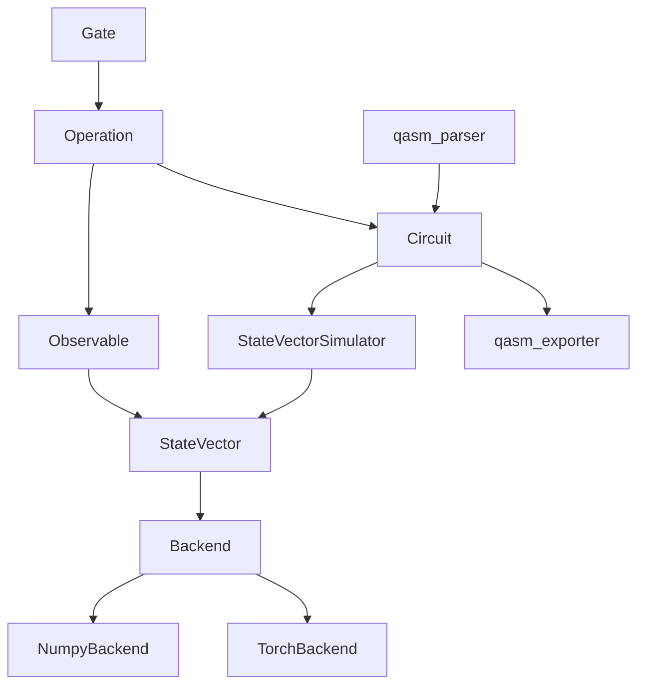

# API 参考

本文档覆盖 `src/` 下所有公开类型与函数的签名和语义。门函数清单单独放在 [gates.md](gates.md)，设计动机与算法细节见 [architecture.md](architecture.md)。

## 1. 导入方式

`src/` 目前是**扁平布局**，没有包装成 Python 包。运行前需要把 `src` 加入 `PYTHONPATH`：

```powershell
$env:PYTHONPATH = Join-Path $PWD 'src'
```

之后直接按模块名导入：

```python
from circuit import Circuit
from observable import Observable, PauliTerm
from simulator import StateVectorSimulator
from single_qubit_gates import H, RX
from statevector import StateVector
from two_qubit_gates import CX
```

## 2. 分层与依赖方向



依赖方向是单向的。`Observable` 不持有也不求值量子态；数值计算全部下沉到 `Backend`；量子语义（端序、qubit 边界、归一化）只留在 `StateVector`。

## 3. `gate` — 门定义

```python
Gate(
    name, num_qubits, matrix, dagger_matrix, *,
    qasm_name, parameters=(), dagger_qasm_name=None, dagger_parameters=None,
)
```

不可变 dataclass，持有一个已绑定参数的门的数学与序列化定义。

| 字段 | 说明 |
|---|---|
| `name` | 内部/显示名称，如 `"RX"` |
| `qasm_name` | OpenQASM 名称，与 `qelib1.inc` 一致 |
| `num_qubits` | 作用的 qubit 数 $k$ |
| `parameters` | 正向参数元组 |
| `dagger_qasm_name` | dagger 的 OpenQASM 名称，默认回退到 `qasm_name` |
| `dagger_parameters` | dagger 参数元组，默认回退到 `parameters` |
| `matrix` / `dagger_matrix` | 只读 `numpy.complex128` 矩阵，形状 $2^k\times 2^k$ |

构造时会把矩阵复制为 `numpy.complex128`、校验形状与有限性，并置为只读。参数属于 `Gate` 而非 `Operation`，因为参数决定矩阵。

`Gate` 不导入 `Operation`；由门函数负责构造 operation。

## 4. `operation` — 执行位置与方向

```python
Operation(gate, qubits, is_dagger=False)
```

不可变 dataclass。`qubits` 必须是长度等于 `gate.num_qubits`、互不相同的非负整数元组。

| 成员 | 类型 | 说明 |
|---|---|---|
| `name` | `str` | dagger 时追加 `†` |
| `qasm_name` | `str` | 按方向取自 gate 元数据 |
| `parameters` | `tuple[float, ...]` | 按方向取自 gate 元数据 |
| `matrix` | `ComplexMatrix` | 按方向取自 gate 元数据 |
| `matrix_key` | `tuple[str, int, tuple[float, ...], bool]` | 后端矩阵缓存键 |
| `dagger()` | `Operation` | 仅翻转方向标志 |

`matrix_key` 是 `(name, num_qubits, parameters, is_dagger)`。**参数和方向都必须保留**：只按名称做键会让 `RX(0.3)` 与 `RX(0.7)` 冲突，丢掉方向会让 `S` 与 `S†` 冲突，两种错误都会静默返回错误的矩阵。

## 5. `circuit` — 电路结构

```python
Circuit(num_qubits)
```

只负责电路结构：有序操作序列、qubit 范围校验、电路级 dagger。不做任何数值计算，也不持有量子态。

| 成员 | 说明 |
|---|---|
| `num_qubits` | 寄存器宽度 |
| `operations` | 返回 `tuple` 快照，调用方无法绕过 `append()` 的校验 |
| `append(operation)` | 流式接口，返回 `self`；qubit 越界抛 `IndexError` |
| `dagger()` | **反转顺序**并逐个取 dagger，返回新 `Circuit` |
| `copy()` | 浅复制操作列表 |
| `len(circuit)` / `iter(circuit)` | 操作个数 / 按序迭代 |

```python
circuit = Circuit(2)
circuit.append(H(0)).append(CX(0, 1))
```

**电路只包含酉演化。测量绝不能出现在 `Circuit` 中**——项目刻意不提供测量操作类型，因此这是结构上强制的。加入测量会让 `Circuit.dagger()` 失去定义，并破坏所有后端 `apply()` 依赖的归一化假设。

## 6. `statevector` — 量子态

```python
StateVector(num_qubits, amplitudes=None, *, backend=None)
```

`amplitudes` 省略时初始化为 $\lvert 0\cdots 0\rangle$；给定时必须形状为 $(2^n,)$、元素有限且已归一化，否则抛 `ValueError`。`backend` 省略时使用模块级 `DEFAULT_BACKEND`（即 `NumpyBackend()`）。

| 成员 | 类型 | 说明 |
|---|---|---|
| `num_qubits` | `int` | |
| `backend` | `Backend` | |
| `amplitudes` | `NDArray[complex128]` | **只读**，无论后端为何都转换为 `complex128` |
| `raw_amplitudes` | `Any` | 后端原生数组（如 `torch.Tensor`） |
| `probabilities` | `NDArray[float64]` | |
| `apply(operation)` | `StateVector` | 唯一的原地修改，返回 `self` 以便链式调用 |
| `inner_product(other)` | `complex` | $\langle \text{self} \mid \text{other}\rangle$，第一个参数取共轭 |
| `expectation(observable)` | `float` | |
| `sample(shots, generator=None)` | `dict[int, int]` | 基态索引 → 计数 |
| `copy()` | `StateVector` | 独立副本，保留后端 |

### 读出规则

**任何读出都不会修改量子态。** `apply()` 是唯一的原地修改，且始终保范。项目不提供 `measure()`、`collapse()` 或任何投影测量 API。

关联性通过 `sample()` 获得——它抽取的是**完整的基态索引**，因此天然保持联合分布。对 Bell 态只会得到 `0` 和 `3`，与逐比特坍缩的结果一致：

```python
state = StateVectorSimulator().run(
    Circuit(2).append(H(0)).append(CX(0, 1))
)
state.sample(1000, np.random.default_rng(0))   # {0: 473, 3: 527}
```

`sample()` 会先对概率向量重新归一化，因为低精度后端的偏差足以让 NumPy 拒绝该分布。随机性通过可注入的 `numpy.random.Generator` 提供，以保证测试可复现。

## 7. `simulator` — 执行编排

```python
StateVectorSimulator(backend=None, *, fusion=False)
simulator.run(circuit, initial_state=None) -> StateVector
```

只负责执行流程：构造或复制 `StateVector`，按序应用电路的操作，其余全部委托给态对象。

- `run()` **不会修改调用方传入的初始态**；
- `run()` 校验电路寄存器与态寄存器一致，不一致抛 `ValueError`；
- 显式指定的 simulator 后端会**覆盖**初始态的后端，避免在错误的设备上静默执行；
- `fusion=True` 会在执行前调用贪心门融合，默认关闭；
- `run()` 是唯一的公开方法。采样、期望值都是既有态的后处理，属于 `StateVector`。

```python
simulator = StateVectorSimulator(fusion=True)
state = simulator.run(circuit)
```

不要为它们添加接收 `Circuit` 的包装方法：那会在每次调用里隐藏一次全新执行，使连续两次测量变成两个独立实验，而不是对同一个态的关联测量。

## 8. `observable` — 可观测量

```python
PauliTerm(coefficient, paulis)
Observable(terms)
```

`Observable` 描述加权 Pauli 串之和，仅此而已，它从不持有或求值量子态。

`PauliTerm` 在构造时校验：系数为有限实数；字母限于 `I`/`X`/`Y`/`Z`；qubit 非负且在同一项内唯一。随后**丢弃 identity 因子并按 qubit 排序**，使相等的算符具有唯一的规范表示。`paulis` 可以是 `(qubit, letter)` 序列或映射。

```python
observable = Observable([
    PauliTerm(1.0, [(0, "Z"), (1, "Z")]),
    PauliTerm(-0.5, {0: "X"}),
])
energy = state.expectation(observable)
```

也可以直接传 `(coefficient, paulis)` 二元组，`Observable` 会自行转换为 `PauliTerm`。

依赖方向是 `StateVector -> Observable -> Operation -> Gate`。不要添加 `Observable.expectation(state)`：那会反转依赖方向，并为同一套数学制造第二个入口。

`expectation()` 不接受裸的 operation 序列——否则像 `RX(0.3)` 这样的非厄米门会给出没有意义的数值却不报错。需要任意算符时用 `inner_product()`。

## 9. `backend` — 数值后端

`Backend` 是 [src/backend.py](../src/backend.py) 中的 `Protocol`，拥有全部数值工作：态创建、类型转换、有限性、模方、门应用、概率、内积、复制、转 NumPy。

```python
name, zero_state, as_amplitudes, shape, is_finite, squared_norm,
apply, probabilities, inner_product, copy, to_numpy
```

规则：

- 后端**不含任何量子语义**，端序、qubit 边界、归一化校验都留在 `StateVector`；
- 设备与精度是后端的构造参数，绝不通过派生 `StateVector` 子类实现；
- 后端各自实现完整的 `apply` 算法，而不是转发到某个数组命名空间，以便各库使用自己的最优执行路径；
- 任何后端的结果都必须在容差内与 `NumpyBackend` 一致；
- 新后端必须登记进 [tests/test_backend.py](../tests/test_backend.py) 的 `available_backends()`。

### `NumpyBackend`

```python
NumpyBackend(dtype=np.complex128)
```

`dtype` 必须是复数类型。`name` 形如 `numpy:complex128`。

### `TorchBackend`

```python
TorchBackend(device="cpu", dtype=None, matrix_cache_size=256)
```

`dtype` 省略时为 `torch.complex128`，可传字符串（如 `"complex64"`）或 `torch.dtype`。`device` 为 `"cuda"` 但 CUDA 不可用时抛 `RuntimeError`。`name` 形如 `torch:cuda:complex64`。

内部按 `Operation.matrix_key` 维护一个容量有界的 LRU 设备矩阵缓存，避免每次门应用都重新做主机到设备的传输。

torch 是**惰性导入**的：`src/` 中任何模块都不在导入期引入 torch，也不假设 CUDA 存在，因此纯 NumPy 环境下整个测试套件依然可用。

## 10. `qasm_exporter` — 导出

```python
export_qasm(circuit, *, register="q", measure_all=False) -> str
format_operation(operation, register) -> str
format_parameter(value) -> str
QASM_VERSION = "2.0"
```

`measure_all=True` 时会额外声明 `creg` 并在末尾追加 `measure q -> c;`。参数用 `repr(float)` 格式化，以保证往返精确。

## 11. `qasm_parser` — 解析

```python
parse_qasm(text) -> QasmProgram
evaluate_expression(text) -> float
GATE_TABLE          # 27 个 qasm 名称 -> (工厂函数, 参数个数, qubit 个数, is_dagger)
QasmError           # 继承自 ValueError
```

`QasmProgram` 是不可变 dataclass：

| 字段 | 说明 |
|---|---|
| `circuit` | `Circuit`，只含酉演化 |
| `measurements` | `tuple[tuple[int, int], ...]`，(qubit, clbit) 对 |
| `num_clbits` | 经典位个数 |

行为约定：

- **不支持的门会抛出 `QasmError` 并指明门名**，绝不跳过无法识别的语句——那会在看似成功的情况下产出语义不同的电路；
- **measure 解析进 `QasmProgram.measurements`，绝不进入 `Circuit`**，电路因此仍可被 dagger、重放和导出；
- measure 之后再出现门会被判为电路中间测量并拒绝，因为模拟器确实无法表示；
- `barrier` 被忽略，它只约束编译器，忽略是安全的；
- **参数表达式绝不使用 `eval()`**，而是用 `ast` 解析并按白名单遍历（常量 `pi`，四则运算，`sin`/`cos`/`tan`/`exp`/`ln`/`sqrt`），因此恶意文件无法执行代码。

## 12. 异常一览

| 异常 | 触发场景 |
|---|---|
| `TypeError` | `num_qubits`/`shots` 非整数；角度非实数；`append()` 传入非 `Operation` |
| `ValueError` | `num_qubits`/`shots` 非正；角度非有限；振幅形状错误、含非有限值或未归一化；qubit 重复；矩阵形状错误；电路与初始态寄存器不匹配 |
| `IndexError` | operation 的 qubit 超出电路或态的寄存器范围 |
| `RuntimeError` | 请求 CUDA 但设备不可用 |
| `QasmError` | OpenQASM 文本非法、含不支持的门或电路中间测量 |

## 13. 完整示例

```python
import numpy as np

from circuit import Circuit
from observable import Observable, PauliTerm
from simulator import StateVectorSimulator
from single_qubit_gates import H, RX
from statevector import StateVector
from two_qubit_gates import CX

circuit = Circuit(2)
circuit.append(H(0)).append(CX(0, 1)).append(RX(0.3, 1))

state = StateVectorSimulator().run(circuit)

print(state.probabilities)
print(state.sample(1000, np.random.default_rng(0)))
print(state.expectation(Observable([PauliTerm(1.0, [(0, "Z"), (1, "Z")])])))

# 电路级 dagger 还原初始态
restored = StateVectorSimulator().run(circuit.dagger(), state)
assert np.isclose(abs(restored.amplitudes[0]), 1.0)
```

切换到 GPU 只需替换后端，其余代码不变：

```python
from torch_backend import TorchBackend

state = StateVectorSimulator(TorchBackend("cuda", "complex64")).run(circuit)
```
