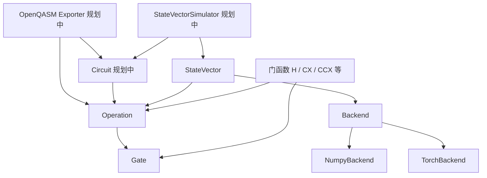

# Simple StateVector Simulator 架构

## 1. 项目定位

Simple StateVector Simulator 是一个使用 Python 和 NumPy 实现的轻量级量子计算模拟器。它使用完整 statevector 表示纯量子态，并通过局部酉矩阵执行量子门。

当前项目关注：

- 纯态 statevector 模拟；
- 单比特、双比特和三比特量子门；
- 任意 qubit 子集上的通用门应用；
- dagger 操作；
- 可插拔的计算后端，量子语义与数值执行分离；
- NumPy 与 PyTorch 后端，支持 CPU 与 CUDA；
- 可供 OpenQASM 导出使用的结构化元数据。

当前不包含：

- 密度矩阵和混合态；
- 噪声信道；
- 测量和采样；
- Circuit 与模拟器执行器；
- OpenQASM 解析器和导出器；
- tensor network、stabilizer 等其他模拟后端。

## 2. 目录结构

```text
simple-statevector-simulator/
├── benchmarks/
│   └── benchmark_backends.py
├── docs/
│   └── architecture.md
├── src/
│   ├── backend.py
│   ├── numpy_backend.py
│   ├── torch_backend.py
│   ├── gate.py
│   ├── operation.py
│   ├── single_qubit_gates.py
│   ├── two_qubit_gates.py
│   ├── three_qubit_gates.py
│   └── statevector.py
└── tests/
    ├── test_backend.py
    ├── test_gate.py
    ├── test_operation.py
    ├── test_single_qubit_gates.py
    ├── test_two_qubit_gates.py
    ├── test_three_qubit_gates.py
    └── test_statevector.py
```

当前 `src` 使用扁平模块布局，测试通过将 `src` 加入 `PYTHONPATH` 导入模块。若项目需要发布为 Python package，可以再迁移到 `src/simple_statevector_simulator/` 包目录。

## 3. 总体分层



当前核心依赖方向为：

```text
Gate <- Operation <- StateVector -> Backend
  ^         ^
  └── 门函数 ┘
```

`Gate` 不依赖 `Operation`，`Backend` 不依赖任何量子概念。用户通过门函数构造 operation，例如：

```python
operation = H(0)
operation = CX(0, 1)
operation = RX(0.5, 2)
```

## 4. 核心数据模型

### 4.1 Gate

`Gate` 表示一个已经绑定参数的具体量子门定义，主要字段如下：

| 字段 | 含义 |
|---|---|
| `name` | 内部和显示名称，例如 `CNOT`、`RX` |
| `qasm_name` | 正向 OpenQASM 指令名，例如 `cx`、`rx` |
| `num_qubits` | 门作用的 qubit 数量 |
| `parameters` | 正向序列化参数 |
| `dagger_qasm_name` | dagger 对应的 OpenQASM 指令名 |
| `dagger_parameters` | dagger 对应的序列化参数 |
| `matrix` | 正向矩阵 |
| `dagger_matrix` | 预先存储的共轭转置矩阵 |

`Gate` 是冻结的 dataclass。构造时会：

1. 检查名称和 qubit 数量；
2. 将参数规范化为有限的 `float` 元组；
3. 检查矩阵形状是否为 $2^k \times 2^k$；
4. 将矩阵复制为 `numpy.complex128`；
5. 将矩阵设为只读，便于多个 operation 安全共享。

常数门使用模块级共享 `Gate` 对象。参数门在门函数调用时创建绑定参数的 `Gate`。

### 4.2 Operation

`Operation` 表示一次具体的门操作：

```text
Operation = Gate + qubits + direction
```

主要字段：

| 字段 | 含义 |
|---|---|
| `gate` | 共享的具体门定义 |
| `qubits` | 有序 qubit 元组 |
| `is_dagger` | 是否使用 dagger 方向 |

`Operation` 负责验证：

- qubit 数量必须与 `gate.num_qubits` 一致；
- qubit 必须是非负整数；
- 同一个 operation 内不能重复使用 qubit。

以下属性会根据 `is_dagger` 选择正确方向：

- `name`；
- `qasm_name`；
- `parameters`；
- `matrix`；
- `matrix_key`。

`matrix_key` 是 `(name, num_qubits, parameters, is_dagger)` 的值元组，供后端缓存转换后的矩阵。它必须同时包含参数和方向：仅用 `name` 会让 `RX(0.3)` 与 `RX(0.7)` 冲突，仅用参数会让 `S` 与 `S†` 冲突，两者都会静默返回错误矩阵。

`dagger()` 不计算矩阵，也不修改参数，而是返回共享同一个 `Gate`、方向相反的新 `Operation`：

```python
inverse = operation.dagger()
original = inverse.dagger()
```

因此自然满足：

$$
(U^\dagger)^\dagger = U
$$

### 4.3 StateVector

`StateVector` 保存 $n$ qubit 纯态的 $2^n$ 个复振幅：

$$
|\psi\rangle = \sum_{i=0}^{2^n-1} a_i |i\rangle,
\qquad
\sum_i |a_i|^2 = 1
$$

默认初始化为：

$$
|0\cdots0\rangle
$$

主要 API：

```python
state = StateVector(3)
state.apply(H(0)).apply(CX(0, 1))

amplitudes = state.amplitudes
probabilities = state.probabilities
copied = state.copy()
```

`apply()` 原地更新振幅并返回 `self`，因此支持链式调用。`amplitudes` 始终返回只读的 `numpy.complex128` 数组，`probabilities` 返回每个计算基态的概率。

`StateVector` 只拥有量子语义和校验，具体数值运算全部委托给后端：

```python
state = StateVector(3, backend=NumpyBackend(dtype=np.complex64))

state.backend           # 当前后端
state.raw_amplitudes    # 后端原生数组
state.amplitudes        # 始终是只读 numpy complex128
```

不传 `backend` 时使用模块级的 `DEFAULT_BACKEND`，即 `NumpyBackend()`。

### 4.4 Backend

`Backend` 是一个 `Protocol`，描述执行 statevector 模拟所需的全部数值能力：

| 方法 | 职责 |
|---|---|
| `zero_state` | 构造 $\|0\cdots0\rangle$ |
| `as_amplitudes` | 将输入转换为后端数组并复制 |
| `shape` | 返回振幅形状 |
| `is_finite` | 判断振幅是否全为有限值 |
| `squared_norm` | 返回 $\langle\psi\|\psi\rangle$ |
| `apply` | 将局部门矩阵作用到振幅上 |
| `probabilities` | 返回 `float64` 概率向量 |
| `copy` | 复制振幅 |
| `to_numpy` | 转换为 `numpy.complex128` |

这里故意选择了**较粗的粒度**：后端实现完整的 `apply` 算法，而不是只转发 `reshape` / `transpose` / `matmul` 等原语。原因是不同后端的最优执行路径本身就不同（例如 `einsum`、原地写入、算子融合或自定义 kernel），若后端只是薄薄的数组命名空间，就无法利用这些差异，而且各库 API 的不一致（如 `transpose` 与 `permute`）会不断泄露。

同时，**设备和精度是后端的构造参数，不是新的量子态类型**。否则 `NumpyStateVector`、`TorchCpuStateVector`、`TorchGpuStateVector` 会随着库、设备、dtype 三个正交维度组合爆炸。

后端不得包含任何量子语义：端序约定、qubit 越界、归一化检查均由 `StateVector` 负责。

### 4.5 TorchBackend

`TorchBackend` 在构造函数内惰性导入 torch，因此模块导入期不依赖 torch，没有安装时其他代码仍可正常工作：

```python
StateVector(3, backend=TorchBackend(device="cuda", dtype="complex64"))
```

实现要点：

- **矩阵缓存**。`Gate` 存的是 numpy 矩阵，若每次 `apply()` 都做 host→device 拷贝，GPU 会显著变慢。缓存按 `operation.matrix_key` 建表。
- **缓存必须有容量上限**。值语义的 key 不会随临时 `Gate` 回收而失效，参数扫描会无限增长并在 GPU 上 OOM，因此使用带 LRU 淘汰的 `OrderedDict`。淘汰只影响性能，不得影响结果。
- **只读矩阵**。`Gate` 的矩阵是只读的，直接 `torch.as_tensor` 会告警并可能共享内存，因此转换前先做一次 numpy 拷贝；有缓存时这个代价每个 key 只付一次。
- **API 差异**。torch 的多轴置换是 `permute`，且 `permute` 后必须用 `reshape` 而非 `view`。
- **只读语义**。torch 张量没有 `writeable=False`，因此 `amplitudes` 仍统一返回只读 numpy，性能敏感路径使用 `raw_amplitudes`。
- **可选依赖**。torch 不在 [requirements.txt](../requirements.txt) 中，而是由单独的 torch requirements 文件安装。

## 5. Qubit 与矩阵约定

### 5.1 全局 statevector 端序

全局 statevector 使用 little-endian qubit 索引：

- qubit 0 是索引的最低有效位；
- statevector 索引 $i$ 的二进制表示写作 $|q_{n-1}\cdots q_1q_0\rangle$。

例如在双 qubit 系统中：

```text
index 0 -> |00>
index 1 -> |01>  # q0 = 1
index 2 -> |10>  # q1 = 1
index 3 -> |11>
```

### 5.2 局部门矩阵基序

局部门矩阵按 `operation.qubits` 的顺序定义，第一个 qubit 是局部基态的最高有效位。

例如：

```python
CX(control, target)
```

局部矩阵基序为：

$$
|control,target\rangle
=
|00\rangle, |01\rangle, |10\rangle, |11\rangle
$$

三比特门同理：

- `CCX(control1, control2, target)` 使用 $|control1,control2,target\rangle$；
- `CSWAP(control,target1,target2)` 使用 $|control,target1,target2\rangle$。

这些约定必须在门定义、statevector 执行、测量和序列化中保持一致。

## 6. 门应用算法

门应用算法位于后端（当前为 `NumpyBackend.apply()`）。`StateVector.apply()` 只做 qubit 越界检查，然后委托给后端：

```python
self._amplitudes = self._backend.apply(
    self._amplitudes,
    operation,
    self._num_qubits,
)
```

后端使用统一的张量轴重排算法，不为任何具体门编写特殊执行路径。

对于作用在 $k$ 个 qubit 上的门：

1. 将长度 $2^n$ 的振幅向量 reshape 为 $n$ 维、每轴长度为 2 的张量；
2. 将目标 qubit 对应的张量轴移动到最前面；
3. reshape 为 $2^k \times 2^{n-k}$ 的振幅矩阵；
4. 使用局部门矩阵左乘；
5. 恢复原轴顺序和一维 statevector。

若用 $t$ 表示目标 qubit 的局部基态，用 $r$ 表示其余 qubit 的基态配置，则完整态可以写为：

$$
|\psi\rangle = \sum_{t,r} a_{t,r}|t\rangle|r\rangle
$$

重排后得到的矩阵 $A=(a_{t,r})$ 仍包含全部 $2^n$ 个振幅。局部门应用为：

$$
A' = UA
$$

这里没有提取目标 qubit 的独立纯态，也没有执行偏迹或测量，因此能够正确保留纠缠。例如对 Bell 态的一个 qubit 应用 $X$：

$$
\frac{|00\rangle+|11\rangle}{\sqrt2}
\xrightarrow{X_0}
\frac{|01\rangle+|10\rangle}{\sqrt2}
$$

该算法也支持非连续 qubit，例如 `CX(2, 0)`。

任何新后端必须在这一算法语义下与 `NumpyBackend` 结果一致，具体实现方式不限。

## 7. 已实现量子门

### 7.1 单比特门

| 门函数 | 参数 | OpenQASM 名称 |
|---|---|---|
| `I` | qubit | `id` |
| `X` | qubit | `x` |
| `Y` | qubit | `y` |
| `Z` | qubit | `z` |
| `H` | qubit | `h` |
| `S` | qubit | `s`，dagger 为 `sdg` |
| `T` | qubit | `t`，dagger 为 `tdg` |
| `P` | theta, qubit | `p` |
| `RX` | theta, qubit | `rx` |
| `RY` | theta, qubit | `ry` |
| `RZ` | theta, qubit | `rz` |
| `U1` | lambda, qubit | `u1` |
| `U2` | phi, lambda, qubit | `u2` |
| `U3` | theta, phi, lambda, qubit | `u3` |

### 7.2 双比特门

| 门函数 | 参数 | OpenQASM 名称 |
|---|---|---|
| `CX` / `CNOT` | control, target | `cx` |
| `CY` | control, target | `cy` |
| `CZ` | control, target | `cz` |
| `CH` | control, target | `ch` |
| `SWAP` | first, second | `swap` |
| `CP` | theta, control, target | `cp` |
| `CRX` | theta, control, target | `crx` |
| `CRY` | theta, control, target | `cry` |
| `CRZ` | theta, control, target | `crz` |

### 7.3 三比特门

| 门函数 | 参数 | OpenQASM 名称 |
|---|---|---|
| `CCX` / `TOFFOLI` | control1, control2, target | `ccx` |
| `CSWAP` / `FREDKIN` | control, target1, target2 | `cswap` |

## 8. Dagger 与序列化模型

模拟和序列化使用同一份方向信息，但职责不同：

- 模拟读取 `operation.matrix`；
- exporter 读取 `operation.qasm_name`、`operation.parameters` 和 `operation.qubits`。

`Gate` 同时保存正向和 dagger 元数据，是因为 dagger 不总是简单地在名称后添加后缀。例如：

```text
S dagger  -> sdg
T dagger  -> tdg
RX(t) dagger -> RX(-t)
```

通用单比特门还需要参数换位：

$$
U3(\theta,\phi,\lambda)^\dagger
=
U3(-\theta,-\lambda,-\phi)
$$

`Operation` 本身不输出 OpenQASM 文本。未来的 exporter 应负责：

- OpenQASM 版本头；
- qubit register 声明；
- 参数格式化；
- operation 到指令文本的转换；
- OpenQASM 2 与 OpenQASM 3 的语法差异。

## 9. 精度与内存

振幅精度由后端决定，默认为 `numpy.complex128`，即实部和虚部均使用双精度浮点数。长度为 $2^n$ 的 statevector 基础内存约为：

$$
2^n \times 16\ \text{bytes}
$$

例如：

| qubit 数 | statevector 基础内存 |
|---:|---:|
| 20 | 16 MiB |
| 25 | 512 MiB |
| 30 | 16 GiB |

实际执行还需要张量视图或临时计算结果。`Gate` 仍固定以 `complex128` 存储矩阵，作为与后端无关的参考定义；后端在 `apply()` 中将其转换为自身 dtype。使用 `complex64` 可以减半内存并在 GPU 上明显提速，但测试容差需相应放宽。

### 9.1 实测结果

在 Quadro P620（Pascal, sm_61, 2 GiB）上，22 qubit 时每个门的 `apply()` 耗时（微秒，取最小值）：

| backend | 1q `H` | 2q `CX` | 3q `CCX` |
|---|---:|---:|---:|
| numpy:complex128 | 73958 | 123499 | 147981 |
| numpy:complex64 | 32454 | 58390 | 65671 |
| torch:cpu:complex64 | 12004 | 39015 | 44049 |
| torch:cuda:complex128 | 16686 | 77436 | 41784 |
| torch:cuda:complex64 | 7331 | 7424 | 9948 |

两个结论：

- `torch:cuda:complex64` 最快，比 `numpy:complex128` 快约 17 倍；
- **GPU 上的 `complex128` 是陷阱**。双比特门慢到 77 ms，是 `complex64` 的 10 倍，甚至比 torch CPU 更慢，这是 Pascal FP64 1/32 速率的直接后果。

矩阵缓存的效果（n = 4，通过缓存容量强制命中与未命中）：

| backend | 命中 | 未命中 |
|---|---:|---:|
| torch:cpu:complex64 | 44.2 | 74.4 |
| torch:cuda:complex64 | 72.6 | 181.7 |

另外，参数门的构造开销远高于常数门：`RX(0.3, 0)` 约 22 微秒，而 `H(0)`、`CX(0, 1)`、`CCX(0, 1, 2)` 均在 2–3 微秒，因为参数门每次都要新建两个矩阵并走完 `Gate` 的全部校验。

## 10. 错误边界

当前各层负责的主要验证如下：

| 层 | 验证职责 |
|---|---|
| `Gate` | 名称、qubit 数量、参数类型与有限性、矩阵形状与有限性 |
| `Operation` | qubit 数量、整数类型、非负、唯一性 |
| `StateVector` | qubit 数量、振幅维度、有限性、归一化、operation 是否越界 |
| `Backend` | 仅 dtype 合法性等自身配置，不承担量子语义校验 |
| 门函数 | 角度必须是有限实数 |

目前 `Gate` 不主动验证矩阵是否幺正。内置门通过测试验证幺正性；未来若支持用户自定义门，可以考虑提供可选的幺正性检查，而不应在性能敏感的每次执行中重复检查。

## 11. 测试策略

测试使用 Python 标准库 `unittest` 和 NumPy 数值断言，当前覆盖：

- Gate 的矩阵复制、只读性和输入验证；
- Operation 的 qubit 验证、方向选择与双重 dagger；
- 所有内置门的矩阵和幺正性；
- 参数门的 dagger 序列化参数；
- 门别名共享同一个 Gate；
- little-endian qubit 约定；
- Bell 态与纠缠态上的局部门应用；
- 非连续 qubit 上的双比特门；
- 三比特门应用；
- StateVector 的复制、归一化与越界检查；
- 后端一致性（[tests/test_backend.py](../tests/test_backend.py)）。

后端一致性测试是参数化的，会在每个可用后端上重复验证 Bell 态、纠缠态局部门、非相邻 qubit、三比特门和 dagger 还原，并与 `NumpyBackend` 逐点比对。新增后端必须加入 `available_backends()`。

运行全部测试：

```powershell
$env:PYTHONPATH = Join-Path $PWD 'src'
python -m unittest discover -s tests -v
```

## 12. 后续架构

推荐按以下顺序扩展：

### 12.1 Circuit

`Circuit` 只保存电路结构，不直接实现 statevector 算法：

```python
class Circuit:
    num_qubits: int
    operations: list[Operation]

    def append(self, operation: Operation) -> "Circuit": ...
    def dagger(self) -> "Circuit": ...
```

`Circuit.dagger()` 需要反转 operation 顺序，并对每个 operation 执行 dagger：

$$
(U_n\cdots U_2U_1)^\dagger
=
U_1^\dagger U_2^\dagger\cdots U_n^\dagger
$$

### 12.2 StateVectorSimulator

执行器负责将声明式 Circuit 运行到 StateVector：

```python
state = StateVectorSimulator().run(circuit)
```

这样可以保持职责分离：

- `Circuit` 描述操作序列；
- `StateVector` 保存量子态；
- `StateVectorSimulator` 管理执行流程。

### 12.3 测量

测量层应基于 `StateVector.probabilities` 实现：

- 全寄存器采样；
- 指定 qubit 测量；
- 测量后的状态坍缩；
- 可注入随机数生成器，以保证测试可复现。

测量不是酉操作，不应建模为普通 `Gate`。

### 12.4 OpenQASM

OpenQASM exporter 应依赖 Circuit 和 Operation，而核心模型不依赖 exporter：

```python
qasm = OpenQASMExporter(version=3).serialize(circuit)
```

如果未来实现 parser，应将解析得到的指令转换为已有门函数或结构化 Gate，而不是让执行器直接解释 QASM 字符串。

### 12.5 Python 包结构

准备发布时，建议迁移为：

```text
src/simple_statevector_simulator/
├── __init__.py
├── gate.py
├── operation.py
├── statevector.py
├── backends/
│   ├── base.py
│   ├── numpy_backend.py
│   └── torch_backend.py
└── gates/
    ├── single.py
    ├── two.py
    └── three.py
```

顶层 `__init__.py` 可以导出主要用户 API：

```python
import simple_statevector_simulator as svs

state = svs.StateVector(2)
state.apply(svs.H(0)).apply(svs.CX(0, 1))
```

在当前规模下不需要立即迁移，避免在核心执行语义尚未稳定时引入打包工作。

## 13. 设计原则

项目后续修改应遵循以下原则：

1. 门的数学定义属于 `Gate`，作用位置属于 `Operation`；
2. 参数与矩阵共同定义具体 Gate，不能分散到 Operation；
3. dagger 矩阵和序列化元数据预先存储，不在执行时推断；
4. 量子语义和校验属于 `StateVector`，数值执行属于 `Backend`；
5. 后端必须用一个通用算法应用任意 $k$-qubit 门；
6. 设备与精度是后端参数，不得衍生新的 `StateVector` 子类；
7. qubit 端序和局部矩阵基序必须明确且保持一致；
8. Circuit、执行、测量和序列化保持独立职责；
9. 先通过测试固定数学语义，再进行性能优化；
10. 不为单个内置门增加执行器特殊分支，除非 profiling 证明必要。